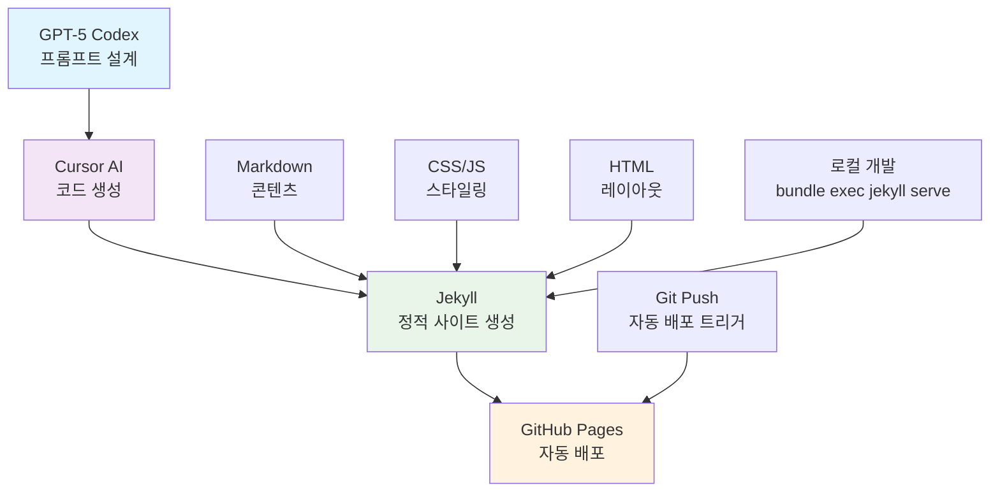
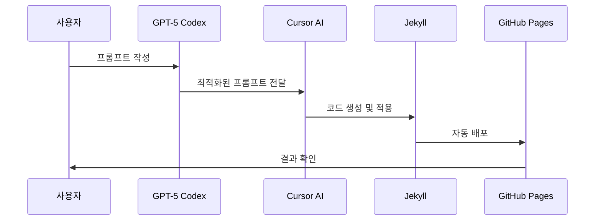

# Wonlog 🚀

> **AI-Powered Personal Blog** - GPT-5 Codex와 Cursor AI를 활용한 개인 블로그

## 📖 프로젝트 소개

**Wonlog**는 GPT-5 Codex를 이용해 프롬프트를 설계하고, 해당 프롬프트를 Cursor AI에 적용하여 구축한 개인 블로그입니다. 정적 사이트 생성기 Jekyll을 기반으로 하며, 깔끔하고 현대적인 UI/UX를 제공합니다.

## 🎯 주요 특징

- **🤖 AI 기반 개발**: GPT-5 Codex 프롬프트 → Cursor AI 적용
- **📱 반응형 디자인**: 데스크톱/모바일 최적화
- **🎨 현대적 UI**: 깔끔한 카드 기반 레이아웃
- **⚡ 빠른 로딩**: Jekyll 정적 사이트 생성
- **📝 뷰어 중심**: 읽기 전용 블로그 경험

## 🏗️ 기술 스택

### 핵심 기술
- **Jekyll 4.4.1** - 정적 사이트 생성기
- **Ruby 3.4.0** - 개발 환경
- **GitHub Pages** - 호스팅 플랫폼

### 프론트엔드
- **HTML5** - 시맨틱 마크업
- **CSS3** - 현대적 스타일링 (Grid, Flexbox, Custom Properties)
- **JavaScript** - 인터랙티브 기능

### 개발 도구
- **Cursor AI** - AI 기반 코드 편집
- **Git** - 버전 관리
- **Bundler** - 의존성 관리

## 🏛️ 아키텍처



## 📁 프로젝트 구조

```
learningssik.github.io/
├── _config.yml              # Jekyll 설정
├── _layouts/                # 레이아웃 템플릿
│   ├── default.html         # 기본 레이아웃
│   ├── post.html           # 포스트 레이아웃
│   └── category.html       # 카테고리 레이아웃
├── _includes/              # 재사용 가능한 컴포넌트
│   └── sidebar.html        # 사이드바 컴포넌트
├── _posts/                 # 블로그 포스트
├── _public/                # 공개 콘텐츠
│   ├── books/              # 독서 카테고리
│   ├── misc/               # 기타 카테고리
│   ├── retrospective/      # 회고 카테고리
│   └── tech/               # 기술 카테고리
├── assets/                 # 정적 자산
│   ├── css/
│   │   └── main.css        # 메인 스타일시트
│   └── js/
│       └── main.js         # 메인 스크립트
├── _site/                  # 빌드된 사이트 (자동 생성)
└── vendor/                 # 의존성 패키지
```

## 🚀 개발 워크플로우

### 1. AI 기반 개발 프로세스


### 2. 로컬 개발 환경 설정

```bash
# 저장소 클론
git clone https://github.com/learningssik/learningssik.github.io.git
cd learningssik.github.io

# 의존성 설치
bundle install

# 로컬 서버 실행
bundle exec jekyll serve

# 브라우저에서 확인
open http://localhost:4000
```

### 3. 배포 프로세스

```bash
# 변경사항 커밋
git add .
git commit -m "feat: 새로운 기능 추가"

# GitHub에 푸시 (자동 배포)
git push origin main
```

## 🎨 디자인 시스템

### 레이아웃 구조
- **헤더**: 브랜드 로고 + 네비게이션
- **사이드바**: 프로필 + 카테고리 목록
- **메인 콘텐츠**: 히어로 섹션 + 포스트 리스트
- **푸터**: 추가 정보

### 반응형 브레이크포인트
- **데스크톱**: ≥1024px (그리드 레이아웃)
- **태블릿**: 768px-1023px (적응형 레이아웃)
- **모바일**: ≤767px (스택 레이아웃)

### 색상 팔레트
- **Primary**: #4f46e5 (파란색)
- **Secondary**: #6b7280 (회색)
- **Background**: #ffffff (흰색)
- **Card**: #f8f9fb (연한 회색)

## 📊 성능 최적화

- **정적 사이트**: 빠른 로딩 속도
- **CSS 최적화**: Custom Properties 활용
- **이미지 최적화**: Jekyll 자동 처리
- **CDN**: GitHub Pages 글로벌 CDN

## 🔧 주요 기능

### ✅ 구현된 기능
- [x] 반응형 레이아웃
- [x] 카테고리별 포스트 분류
- [x] 사이드바 네비게이션
- [x] 포스트 카드 UI
- [x] 자동 배포
- [x] SEO 최적화

### 🚧 향후 계획
- [ ] 다크 모드 지원
- [ ] 검색 기능
- [ ] 댓글 시스템
- [ ] 소셜 공유
- [ ] 다국어 지원

## 🤝 기여하기

1. Fork the Project
2. Create your Feature Branch (`git checkout -b feature/AmazingFeature`)
3. Commit your Changes (`git commit -m 'Add some AmazingFeature'`)
4. Push to the Branch (`git push origin feature/AmazingFeature`)
5. Open a Pull Request

## 📄 라이선스

이 프로젝트는 MIT 라이선스 하에 배포됩니다. 자세한 내용은 `LICENSE` 파일을 참조하세요.

## 📞 연락처

- **GitHub**: [@learningssik](https://github.com/learningssik)
- **Blog**: [Wonlog](https://learningssik.github.io)

---

<div align="center">

**Made with ❤️ using GPT-5 Codex + Cursor AI**

[](https://jekyllrb.com/)
[](https://www.ruby-lang.org/)
[](https://pages.github.com/)

</div>
