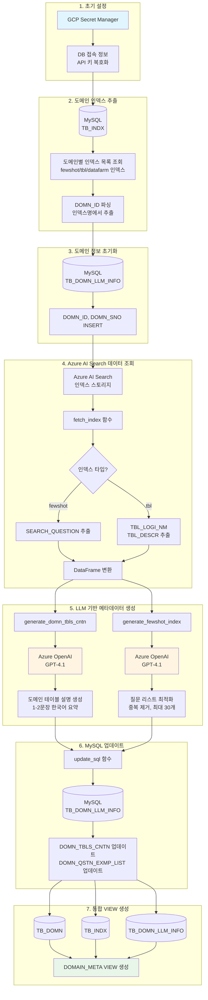
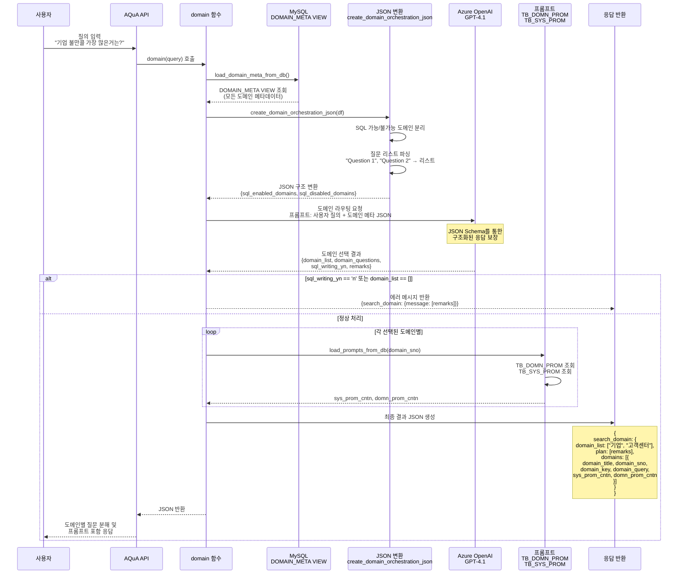
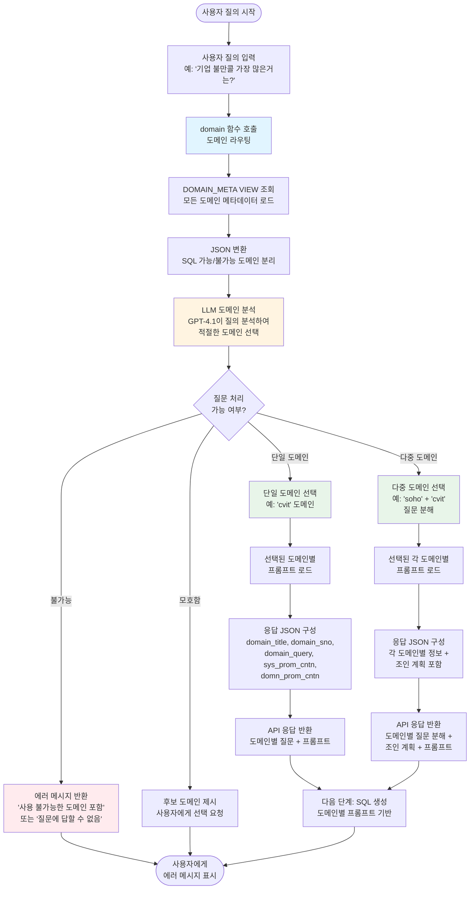

# Domain 메타 자동 생성 시스템 개발

## 개요

이 프로젝트는 **AQuA (Ask Query by AI)** 시스템의 도메인 메타데이터를 자동으로 생성하고 관리하는 시스템입니다. Azure AI Search 인덱스와 MySQL 데이터베이스를 연계하여, LLM을 활용해 도메인별 설명과 샘플 질문 리스트를 자동 생성하고, 사용자 질의에 적합한 도메인을 자동으로 라우팅하는 오케스트레이션 기능을 제공합니다.

시스템은 총 17개의 도메인(기업, 고객센터, HR, 데이터팜 등)의 메타데이터를 관리하며, 각 도메인별로 테이블 설명, 샘플 질문 리스트, SQL 작성 가능 여부 등을 자동으로 생성 및 업데이트합니다.

---

## 문제 해결

### 기존 문제점
- 다수의 도메인(17개 이상)에 대한 메타데이터를 수동으로 관리해야 함
- 각 도메인별 테이블 설명과 샘플 질문을 일일이 작성해야 하는 번거로움
- 사용자 질의에 적합한 도메인을 수동으로 선택해야 하는 비효율성
- 도메인별 프롬프트와 설정 정보의 중앙 관리 부재

### 제공하는 효과 및 기능
1. **자동화된 메타데이터 생성**: LLM을 활용하여 도메인별 테이블 설명과 질문 리스트를 자동 생성
2. **중앙 집중식 관리**: MySQL VIEW를 통해 모든 도메인 메타데이터를 통합 조회
3. **지능형 도메인 라우팅**: 사용자 질의를 분석하여 적절한 도메인을 자동으로 선택
4. **효율적인 데이터 처리**: Azure AI Search와 MySQL을 연계한 대용량 데이터 처리
5. **보안 강화**: GCP Secret Manager를 통한 민감 정보 관리

---

## 구현 방식

### 전체 워크플로우

```
[1단계: 초기 설정]
└─ Secret Manager 설정 (DB 접속 정보, API 키 등)

[2단계: 도메인 인덱스 추출]
└─ MySQL에서 도메인별 인덱스 목록 조회
   └─ TB_INDX 테이블에서 fewshot/tbl/datafarm 인덱스 추출
   └─ DOMN_ID 파싱 (인덱스명에서 도메인 ID 추출)

[3단계: 도메인 정보 초기화]
└─ TB_DOMN_LLM_INFO 테이블에 DOMN_ID, DOMN_SNO INSERT

[4단계: Azure AI Search 데이터 조회]
└─ fetch_index() 함수로 인덱스별 데이터 조회
   ├─ fewshot 인덱스: SEARCH_QUESTION 추출
   └─ tbl 인덱스: TBL_LOGI_NM, TBL_DESCR 추출

[5단계: LLM 기반 메타데이터 생성]
├─ generate_domn_tbls_cntn(): 테이블 설명 기반 도메인 설명 생성
└─ generate_fewshot_index(): 퓨샷 질문 리스트 중복 제거 및 최적화 (최대 30개)

[6단계: MySQL 업데이트]
└─ update_sql() 함수로 각 도메인별 메타데이터 저장
   ├─ DOMN_TBLS_CNTN: 도메인 테이블 설명
   └─ DOMN_QSTN_EXMP_LIST: 샘플 질문 리스트

[7단계: 통합 VIEW 생성]
└─ DOMAIN_META VIEW 생성 (모든 도메인 메타데이터 통합)

[8단계: 도메인 오케스트레이션]
└─ domain() 함수로 사용자 질의 분석 및 도메인 라우팅
   ├─ 도메인 메타 JSON 변환 (SQL 가능/불가능 도메인 분리)
   ├─ LLM을 통한 도메인 선택 및 질문 분해
   └─ 선택된 도메인별 프롬프트 로드
```

### 핵심 함수 및 알고리즘

#### 1. Secret Manager 설정 (`secret_manage`)
```python
def secret_manage(secret_id, env_tran='n'):
    """환경(dev/prod)에 따라 GCP Secret Manager에서 시크릿 값 조회"""
    env = os.getenv("ENV", "dev").lower()
    if env_tran == 'y':
        env = 'prod'
    # 프로젝트 ID 선택 및 시크릿 조회
```

**특징**: 
- 개발/운영 환경 분리
- Compute Engine Credentials를 통한 인증
- UTF-8 디코딩 처리

#### 2. Azure AI Search 인덱스 조회 (`fetch_index`)
```python
def fetch_index(index_name):
    """인덱스 타입(fewshot/tbl)에 따라 다른 필드 조회"""
    if 'fewshot' in index_name:
        headers_list = ["SEARCH_QUESTION", ...]
    else:
        headers_list = ["TBL_LOGI_NM", "TBL_DESCR", ...]
    # SearchClient로 전체 문서 스트리밍하여 DataFrame 반환
```

**특징**:
- 인덱스 타입별 필드 자동 선택
- 전체 문서 스트리밍으로 대용량 데이터 처리
- 도메인 필터링 지원

#### 3. LLM 기반 도메인 설명 생성 (`generate_domn_tbls_cntn`)
```python
def generate_domn_tbls_cntn(df, domain_id, client):
    """테이블 리스트를 프롬프트로 변환하여 LLM이 도메인 설명 생성"""
    table_list = [f"- {row['TBL_LOGI_NM']}: {row['TBL_DESCR']}" 
                  for _, row in df.iterrows()]
    # 프롬프트: "도메인의 테이블들을 보고 1-2문장으로 요약하라"
    # GPT-4.1 모델 사용, temperature=0
```

**알고리즘**:
1. 테이블 논리명과 설명을 리스트로 포맷팅
2. LLM에게 도메인별 테이블 정보 제공
3. 1-2문장의 한국어 요약 생성
4. JSON이나 추가 포맷팅 없이 순수 텍스트 반환

#### 4. 퓨샷 질문 리스트 최적화 (`generate_fewshot_index`)
```python
def generate_fewshot_index(df, domain_id, client):
    """중복 및 유사 질문 제거, 최대 30개로 다양성 극대화"""
    # 프롬프트: 
    # 1. 완전 중복 제거
    # 2. 의미적으로 유사한 질문 통합
    # 3. 최대 30개로 제한하되 주제 다양성 극대화
    # 출력 형식: "Question 1", "Question 2", ...
```

**최적화 전략**:
- 중복 제거 → 의미적 유사도 통합 → 다양성 기반 선택
- 쿼드러플 따옴표 형식으로 일관된 출력 형식 유지

#### 5. 도메인 오케스트레이션 (`domain`)
```python
def domain(query):
    """사용자 질의를 분석하여 적절한 도메인 선택 및 질문 분해"""
    # 1. 도메인 메타 JSON 변환 (SQL 가능/불가능 분리)
    # 2. LLM에게 도메인 라우팅 요청
    # 3. JSON Schema를 통한 구조화된 응답 보장
    # 4. 선택된 도메인별 프롬프트 로드
```

**라우팅 로직**:
- 단일 도메인: 해당 도메인 선택
- 다중 도메인: 질문을 도메인별로 분해하여 조인 계획 제시
- 모호한 질문: 후보 도메인 제시 후 사용자 선택 요청
- 불가능한 질문: 사용 불가능한 도메인 포함 시 쿼리 작성 불가 메시지

**JSON Schema 구조**:
```json
{
  "domain_list": ["domain1", "domain2"],
  "domain_questions": {
    "domain1": ["질문1", "질문2"]
  },
  "sql_writing_yn": "y/n",
  "remarks": "한국어 설명"
}
```

#### 6. 도메인 메타 JSON 변환 (`create_domain_orchestration_json`)
```python
def create_domain_orchestration_json(df):
    """도메인 메타 DataFrame을 SQL 가능 여부별로 분리하여 JSON 변환"""
    # DOMN_QSTN_EXMP_LIST 파싱: "Question 1", "Question 2" → 리스트
    # sql_enabled_domains / sql_disabled_domains 분리
```

**데이터 구조화**:
- 질문 리스트 문자열 파싱 (쉼표 및 따옴표 제거)
- 도메인별 메타데이터 표준화 (domain_sno, domain_title, summary, description, sample_queries, domain_caution)

### 데이터베이스 스키마

#### TB_DOMN_LLM_INFO 테이블
- `DOMN_ID`: 도메인 ID (예: 'soho', 'cvit')
- `DOMN_SNO`: 도메인 번호
- `DOMN_TBLS_CNTN`: LLM이 생성한 도메인 테이블 설명
- `DOMN_QSTN_EXMP_LIST`: 최적화된 샘플 질문 리스트

#### DOMAIN_META VIEW
```sql
CREATE OR REPLACE VIEW DOMAIN_META AS
SELECT 
  TB_DOMN.DOMN_SNO,
  TB_INDX.DOMN_ID,
  TB_DOMN.DOMN_TIT,
  TB_DOMN.DOMN_CNTN AS DOMN_SUMRY_NM,
  TB_DOMN.DOMN_PROM_DSCR AS DOMN_DSCR,
  TB_DOMN_LLM_INFO.DOMN_TBLS_CNTN,
  TB_DOMN_LLM_INFO.DOMN_QSTN_EXMP_LIST,
  CASE WHEN ... THEN 'Y' ELSE 'N' END AS IS_SQL_DOMAIN
FROM TB_DOMN
LEFT JOIN TB_INDX ON ...
LEFT JOIN TB_DOMN_LLM_INFO ON ...
```

---

## 리팩토링 제안

### 1. 에러 핸들링 강화
- **현재**: 기본적인 try-except만 존재
- **개선**: 
  - Azure AI Search API 호출 실패 시 재시도 로직
  - LLM 호출 실패 시 fallback 메커니즘
  - MySQL 연결 실패 시 자동 재연결

```python
from tenacity import retry, stop_after_attempt, wait_exponential

@retry(stop=stop_after_attempt(3), wait=wait_exponential(multiplier=1, min=2, max=10))
def fetch_index_with_retry(index_name):
    # 재시도 로직 포함
```

### 2. 배치 처리 최적화
- **현재**: 도메인별 순차 처리로 LLM API 호출 시간이 오래 걸림
- **개선**: 
  - 비동기 처리 (asyncio) 또는 멀티프로세싱으로 병렬 처리
  - 배치 단위로 묶어서 처리하여 API 호출 횟수 감소

```python
import asyncio
from openai import AsyncAzureOpenAI

async def generate_domn_tbls_cntn_async(df, domain_id, client):
    # 비동기 LLM 호출

async def process_all_domains():
    tasks = [generate_domn_tbls_cntn_async(...) for ...]
    results = await asyncio.gather(*tasks)
```

### 3. 캐싱 메커니즘 도입
- **현재**: 매번 Azure AI Search에서 전체 인덱스 조회
- **개선**: 
  - 도메인별 인덱스 데이터를 로컬 캐시 (Redis 또는 파일)
  - 변경 감지 시에만 업데이트

### 4. 설정 파일 분리
- **현재**: 하드코딩된 설정값들 (service_endpoint, model명 등)
- **개선**: 
  - config.yaml 또는 환경 변수로 분리
  - 도메인별 설정 관리 용이성 향상

### 5. 로깅 및 모니터링
- **현재**: print 문으로만 디버깅
- **개선**: 
  - 구조화된 로깅 (logging 모듈)
  - 각 단계별 실행 시간 측정
  - 실패율 및 성공률 모니터링

### 6. 타입 힌팅 및 문서화
- **현재**: 함수별 타입 힌팅 불완전
- **개선**: 
  - 모든 함수에 타입 힌팅 추가
  - docstring 표준화 (Google/NumPy 스타일)

### 7. 데이터 검증 강화
- **현재**: LLM 응답에 대한 검증 부족
- **개선**: 
  - 생성된 설명의 길이 및 형식 검증
  - 질문 리스트의 최소/최대 개수 검증
  - JSON 파싱 실패 시 재시도

---

## 학습 내용

### 기술적 인사이트

1. **LLM을 활용한 메타데이터 자동화**
   - 대량의 도메인 메타데이터를 수동으로 관리하는 대신, LLM이 테이블 설명과 질문 리스트를 자동 생성
   - 프롬프트 엔지니어링의 중요성: 출력 형식을 명확히 지정하면 후처리 비용 감소
   - temperature=0 설정으로 일관된 결과 생성

2. **하이브리드 아키텍처의 효율성**
   - Azure AI Search (벡터 검색) + MySQL (구조화된 메타데이터) + LLM (자동 생성)의 조합
   - 각 시스템의 장점을 활용하여 전체 파이프라인 최적화

3. **도메인 오케스트레이션 패턴**
   - 사용자 질의를 분석하여 적절한 도메인을 자동 선택하는 라우터 패턴
   - JSON Schema를 통한 구조화된 LLM 응답 보장
   - SQL 가능/불가능 도메인 분리로 쿼리 작성 가능 여부 사전 판단

4. **데이터 파이프라인 최적화**
   - Azure AI Search의 스트리밍 방식으로 대용량 데이터 처리
   - 도메인별 필터링으로 불필요한 데이터 조회 최소화
   - DataFrame을 활용한 효율적인 데이터 변환

### 프로젝트 관리 인사이트

1. **초기 설정의 중요성**
   - Secret Manager를 통한 보안 정보 관리로 환경별 설정 분리
   - VIEW 생성으로 통합 조회 인터페이스 제공하여 유지보수성 향상

2. **확장성 고려**
   - 17개 도메인을 동일한 로직으로 처리하는 범용 설계
   - 새로운 도메인 추가 시 최소한의 코드 변경으로 확장 가능

3. **자동화의 균형**
   - LLM 자동 생성 + 수동 검토/보정의 조합
   - 데이터팜 같은 특수 케이스는 하드코딩으로 처리하여 정확성 보장

### 개선이 필요한 영역

1. **성능 최적화**
   - 현재는 순차 처리로 인해 전체 실행 시간이 길 수 있음
   - 비동기 처리나 배치 처리로 병렬화 필요

2. **에러 복구 메커니즘**
   - 일부 도메인 처리 실패 시 전체 프로세스 중단되지 않도록 개선
   - 부분 실패 시 재시도 로직 필요

3. **모니터링 및 알림**
   - 실행 결과를 모니터링하고 이상 상황 시 알림 기능 추가
   - 생성된 메타데이터의 품질 검증 자동화

이번 개발을 통해 **LLM 기반 자동화 시스템의 설계 패턴**과 **여러 클라우드 서비스를 통합하는 하이브리드 아키텍처**에 대한 깊은 이해를 얻었습니다. 특히 도메인별로 다른 특성을 가진 데이터를 일관된 인터페이스로 처리하는 방법과, 사용자 질의를 지능적으로 분석하여 적절한 도메인으로 라우팅하는 오케스트레이션 패턴을 배울 수 있었습니다.

---

## 도메인 메타 테이블 구성 및 사용 플로우

### 도메인 메타 테이블 구성 요소

`DOMAIN_META` VIEW는 다음과 같은 **소스 테이블들**을 조인하여 생성됩니다:

#### 1. TB_DOMN (도메인 기본 정보 테이블)
- `DOMN_SNO`: 도메인 번호 (Primary Key)
- `DOMN_TIT`: 도메인 명 (예: "기업", "고객센터 상담 VOC 홈/모바일")
- `DOMN_CNTN`: 도메인 요약 내용 → `DOMN_SUMRY_NM`으로 사용
- `DOMN_PROM_DSCR`: 도메인 설명 → `DOMN_DSCR`로 사용
- `DOMN_ACTV_YN`: 사용 중인 도메인 여부 (필터링 조건)

#### 2. TB_INDX (인덱스 정보 테이블)
- `DOMN_SNO`: 도메인 번호
- `INDX_NM`: 인덱스명 (예: "soho-tbl-index-prod")
- 도메인 ID 추출: `SUBSTRING_INDEX(INDX_NM, '-', 1)` → `DOMN_ID` (예: "soho", "cvit")
- 필터링: `INDX_NM LIKE '%tbl%' OR INDX_NM LIKE '%datafarm%'`

#### 3. TB_DOMN_LLM_INFO (LLM 생성 메타정보 테이블)
- `DOMN_ID`: 도메인 ID (예: 'soho', 'cvit')
- `DOMN_SNO`: 도메인 번호
- `DOMN_TBLS_CNTN`: LLM이 생성한 도메인 테이블 설명 (도메인이 어떤 데이터를 다루는지)
- `DOMN_QSTN_EXMP_LIST`: LLM이 최적화한 샘플 질문 리스트 (최대 30개, 중복 제거)

#### 4. TB_DOMN_PROM (도메인별 프롬프트 테이블)
- `DOMN_SNO`: 도메인 번호
- `DOMN_PROM_CNTN`: 도메인별 프롬프트 (SQL 작성 가이드라인 등)

#### 5. TB_SYS_PROM (시스템 프롬프트 테이블)
- `DOMN_SNO`: 도메인 번호
- `SYS_PROM_CNTN`: 시스템 프롬프트 (AI 어시스턴트 역할 및 행동 규칙)

#### DOMAIN_META VIEW 생성 로직
```sql
CREATE OR REPLACE VIEW DOMAIN_META AS
SELECT 
  TB_DOMN.DOMN_SNO,                    -- 도메인 번호
  TB_INDX.DOMN_ID,                     -- 도메인 ID (인덱스명에서 추출)
  TB_DOMN.DOMN_TIT,                    -- 도메인 명
  TB_DOMN.DOMN_CNTN AS DOMN_SUMRY_NM, -- 도메인 요약
  TB_DOMN.DOMN_PROM_DSCR AS DOMN_DSCR, -- 도메인 설명
  TB_DOMN_LLM_INFO.DOMN_TBLS_CNTN,    -- 도메인 테이블 설명 (LLM 생성)
  TB_DOMN_LLM_INFO.DOMN_QSTN_EXMP_LIST, -- 샘플 질문 리스트 (LLM 생성)
  CASE WHEN 
    TB_DOMN.DOMN_CNTN NOT LIKE '%테스트%' 
      AND TB_INDX.DOMN_ID is not null 
      AND TB_INDX.DOMN_ID != 'test'
      AND TB_INDX.DOMN_ID != 'hr'      -- HR 제외
      AND TB_INDX.DOMN_ID != 'csqt'    -- 품질혁신센터 제외
      AND TB_INDX.DOMN_ID != 'nw'      -- 넛지 제외
      AND TB_INDX.DOMN_ID != 'datafarm' -- 데이터팜 리포트 제외
    THEN 'Y' ELSE 'N' END AS IS_SQL_DOMAIN  -- SQL 작성 가능 여부
FROM TB_DOMN
LEFT JOIN TB_INDX ON TB_DOMN.DOMN_SNO = TB_INDX.DOMN_SNO
LEFT JOIN TB_DOMN_LLM_INFO ON TB_DOMN.DOMN_SNO = TB_DOMN_LLM_INFO.DOMN_SNO
WHERE TB_DOMN.DOMN_ACTV_YN = 'Y'  -- 사용 중인 도메인만
```

### 백엔드 플로우 (도메인 메타 생성 프로세스)



### 사용자 질의 시 플로우 (도메인 오케스트레이션)



### 사용자 시나리오 플로우 (전체 사용자 경험)



### 도메인 메타 테이블 사용 예시

#### 사용자 질의: "기업 불만콜 가장 많은거는?"

**1단계: 도메인 메타 로드**
```python
domain_meta_df = load_domain_meta_from_db()
# DOMAIN_META VIEW에서 조회:
# - soho 도메인: 기업 관련 데이터
# - cvit 도메인: 고객센터 상담 VOC 데이터
```

**2단계: JSON 변환**
```python
domain_meta_json = create_domain_orchestration_json(domain_meta_df)
# sql_enabled_domains: {soho: {...}, cvit: {...}}
# sql_disabled_domains: {hr: {...}, datafarm: {...}}
```

**3단계: LLM 도메인 라우팅**
```json
{
  "domain_list": ["soho", "cvit"],
  "domain_questions": {
    "soho": ["기업 불만콜 건수"],
    "cvit": ["기업 불만콜 건수"]
  },
  "sql_writing_yn": "y",
  "remarks": "기업 불만콜(민원, VOC) 관련 데이터는 soho(기업)와 cvit(고객센터 상담 VOC 홈/모바일) 도메인 모두에서 조회할 수 있습니다. 두 도메인을 조인하여 기업별 불만콜(민원/VOC) 건수 TOP 순위를 확인할 수 있습니다."
}
```

**4단계: 프롬프트 로드**
```python
# soho 도메인 (domain_sno=11)
sys_prom_cntn, domn_prom_cntn = load_prompts_from_db(11)
# TB_SYS_PROM에서 시스템 프롬프트 조회
# TB_DOMN_PROM에서 도메인 프롬프트 조회

# cvit 도메인 (domain_sno=2)
sys_prom_cntn, domn_prom_cntn = load_prompts_from_db(2)
```

**5단계: 최종 응답**
```json
{
  "search_domain": {
    "domain_list": ["기업", "고객센터 상담 VOC 홈/모바일"],
    "plan": ["기업 불만콜(민원, VOC) 관련 데이터는..."],
    "domains": [
      {
        "domain_title": "기업",
        "domain_sno": 11,
        "domain_key": "soho",
        "domain_query": ["기업 불만콜 건수"],
        "sys_prom_cntn": "...",
        "domn_prom_cntn": "..."
      },
      {
        "domain_title": "고객센터 상담 VOC 홈/모바일",
        "domain_sno": 2,
        "domain_key": "cvit",
        "domain_query": ["기업 불만콜 건수"],
        "sys_prom_cntn": "...",
        "domn_prom_cntn": "..."
      }
    ]
  }
}
```

이 응답을 받은 후, AQuA 시스템은 각 도메인별 프롬프트를 활용하여 SQL 쿼리를 생성하고, 필요시 두 도메인을 조인하여 최종 결과를 반환합니다.

