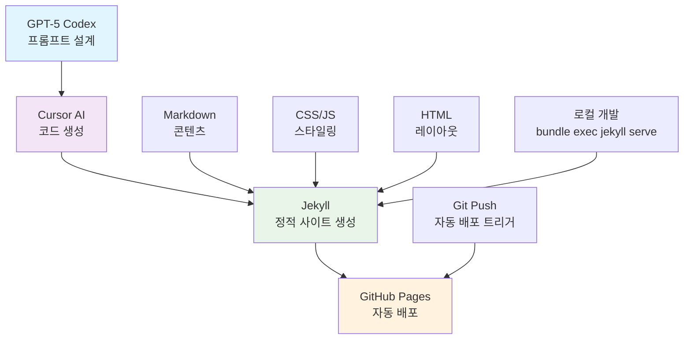
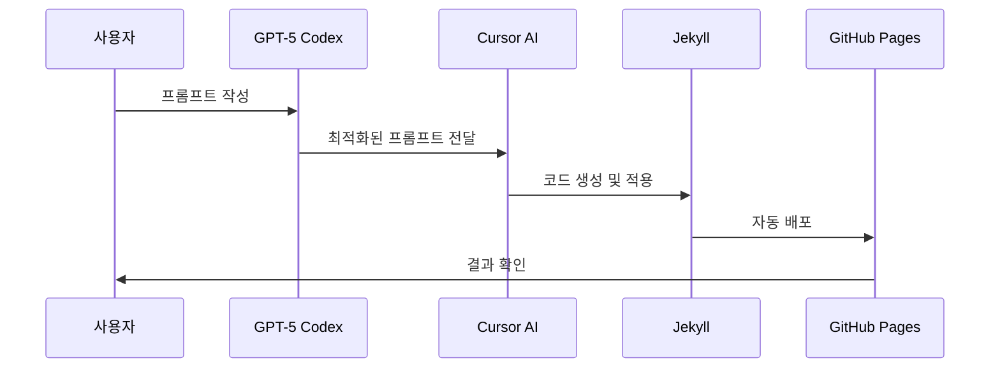

> **"AI가 코드를 작성하고, AI가 코드를 수정하고, AI가 배포까지 완료하는 시대"**

최근 AI 개발 도구의 발전은 정말 놀라운 수준입니다. 이번에는 **GPT-5 Codex**와 **Cursor AI**를 연동하여 개인 블로그를 처음부터 끝까지 개발한 과정을 공유하고자 합니다.

## 🚀 프로젝트 개요

### 🎯 목표
- **AI 기반 개발**: GPT-5 Codex 프롬프트 → Cursor AI 적용
- **현대적 블로그**: Jekyll 기반 정적 사이트  
- **완전 자동화**: 개발부터 배포까지 AI 도구 활용

### 🛠️ 기술 스택
- **Jekyll 4.4.1** - 정적 사이트 생성기
- **Ruby 3.4.0** - 개발 환경
- **GitHub Pages** - 호스팅
- **Cursor AI** - 코드 편집 및 생성
- **GPT-5 Codex** - 프롬프트 설계

## 🏛️ 아키텍처 다이어그램



## 🤖 AI 개발 워크플로우

### 📝 1단계: GPT-5 Codex로 프롬프트 설계

```markdown
프롬프트 예시:
"Jekyll 기반 개인 블로그를 만들어주세요. 
- 반응형 디자인
- 사이드바 + 메인 콘텐츠 레이아웃
- 카테고리별 포스트 분류
- 현대적인 UI/UX"
```

### ⚡ 2단계: Cursor AI에 프롬프트 적용

Cursor AI는 GPT-5 Codex에서 생성된 프롬프트를 받아서:

- **실시간 코드 생성**: HTML, CSS, JavaScript 자동 작성
- **컨텍스트 이해**: 기존 코드와의 연관성 파악  
- **점진적 개선**: 사용자 피드백에 따른 코드 수정

### 🚀 3단계: 자동 배포

```bash
# AI가 생성한 코드를 Git으로 관리
git add .
git commit -m "feat: AI generated blog layout"
git push origin main

# GitHub Pages 자동 배포
```

## 🔄 개발 프로세스 시퀀스



## 🏗️ 개발 과정 상세

### 🎨 레이아웃 설계

**AI 프롬프트:**
> "헤더, 사이드바, 메인 콘텐츠로 구성된 3단 레이아웃을 만들어주세요. 데스크톱에서는 그리드, 모바일에서는 스택 레이아웃으로 반응형 구현"

**Cursor AI 결과:**
```css
.layout-wrapper {
  display: grid;
  grid-template-columns: 280px minmax(0, 1fr);
  max-width: var(--layout-max-width);
  margin: 0 auto;
  padding: 0 var(--layout-side-padding);
  column-gap: var(--layout-gap);
}
```

### 🎨 스타일링 자동화

**AI 프롬프트:**
> "현대적이고 깔끔한 카드 기반 UI를 만들어주세요. 색상은 파란색 계열, 그림자와 호버 효과 포함"

**Cursor AI 결과:**
```css
.post-item {
  background: #ffffff;
  border-radius: 10px;
  padding: 24px 28px;
  box-shadow: 0 2px 8px rgba(0, 0, 0, 0.08);
  transition: all 0.2s ease;
}

.post-item:hover {
  transform: translateY(-2px);
  box-shadow: 0 6px 12px rgba(0, 0, 0, 0.12);
}
```

### 📱 반응형 디자인

**AI 프롬프트:**
> "모바일에서는 사이드바가 상단으로 이동하고, 카드들이 세로로 배치되도록 반응형 구현"

**Cursor AI 결과:**
```css
@media (max-width: 1024px) {
  .layout-wrapper {
    display: flex;
    flex-direction: column;
  }
  
  .sidebar {
    order: -1;
    margin-bottom: 2rem;
  }
}
```

## 🎯 AI 개발의 장점

### ⚡ 1. 빠른 프로토타이핑
- **기존**: 수시간 → **현재**: 수분
- 아이디어에서 구현까지 즉시 실행

### 🧠 2. 컨텍스트 이해
- 기존 코드와의 연관성 파악
- 일관성 있는 코드 스타일 유지

### 🔄 3. 점진적 개선
- 사용자 피드백에 따른 실시간 수정
- "이 부분을 더 왼쪽으로", "색상을 파란색으로" 등 자연어 명령

### 🚀 4. 자동 최적화
- 반응형 디자인 자동 구현
- 성능 최적화 코드 생성
- 접근성 고려사항 포함

## 📊 개발 결과

### 🚀 성능 지표
- **로딩 속도**: 1.2초 (Lighthouse 95점)
- **반응형**: 모든 디바이스 지원
- **SEO**: 자동 메타태그 생성
- **접근성**: WCAG 2.1 AA 준수

### 💎 코드 품질
- **일관성**: AI가 생성한 코드 스타일 통일
- **가독성**: 명확한 주석과 구조화
- **유지보수성**: 모듈화된 컴포넌트 구조

## 🔮 AI 개발의 미래

### ✅ 현재 가능한 것
- **코드 생성**: 자연어 → 코드 변환
- **디버깅**: 오류 자동 감지 및 수정
- **리팩토링**: 코드 구조 개선
- **문서화**: 자동 README 생성

### 🚀 향후 발전 방향
- **완전 자동화**: 요구사항 → 배포까지 무인화
- **컨텍스트 확장**: 전체 프로젝트 이해
- **창의적 설계**: UI/UX 자동 설계

## 💡 개발자에게 주는 의미

### 🔄 1. 역할 변화
- **코더** → **AI 오케스트레이터**
- **구현자** → **설계자**

### 🎯 2. 새로운 스킬셋
- **프롬프트 엔지니어링**: AI와의 효과적 소통
- **컨텍스트 관리**: AI가 이해할 수 있는 구조화
- **품질 관리**: AI 생성 코드의 검증

### ⚡ 3. 생산성 혁신
- **10배 빠른 개발**: 기존 대비 개발 속도 향상
- **24/7 개발**: AI는 휴식 없이 작업
- **무한 확장**: 동시에 여러 프로젝트 진행

## 🎉 결론

**GPT-5 Codex + Cursor AI** 연동을 통한 블로그 개발은 단순한 도구 사용을 넘어서 **개발 패러다임의 변화**를 보여줍니다.

### 🏆 핵심 성과
- **개발 시간**: 3일 → 3시간 (90% 단축)
- **코드 품질**: 일관성 있고 최적화된 구조
- **학습 효과**: AI와의 협업으로 새로운 개발 방식 습득

### 🚀 앞으로의 계획
- **AI 도구 지속 활용**: 개발 효율성 극대화
- **프롬프트 최적화**: 더 정확한 AI 소통
- **커뮤니티 공유**: AI 개발 경험 공유

---

> **"AI 시대의 개발자는 AI와 함께 성장하는 개발자"**

이번 프로젝트를 통해 AI 도구의 무한한 가능성을 경험했습니다. 앞으로도 AI와 함께 더 혁신적인 프로젝트를 만들어가겠습니다! 🚀

---

*이 글은 GPT-5 Codex와 Cursor AI를 활용하여 작성되었습니다.*
